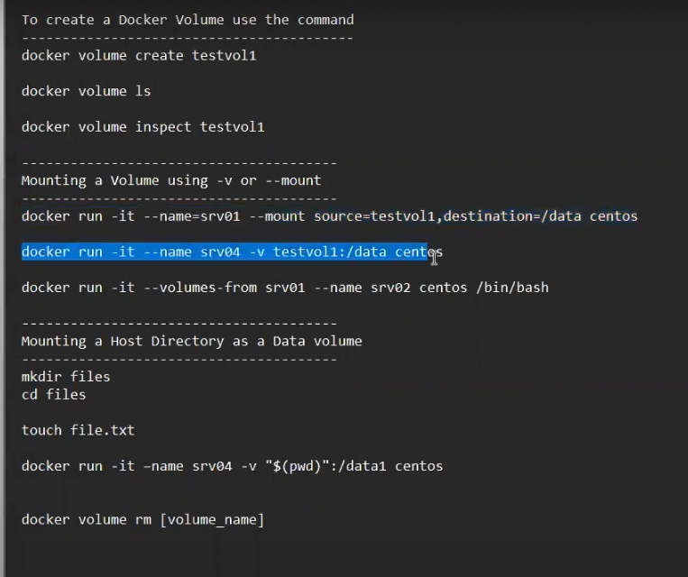

BindMounts:

    it allows you to bind a directory inside your container

Volumes:

volumes offer a better lifecycle.
using docker cli ,using docker commands can create volumes.
we can create volume an destroy volume.

tehnically both bindmound and volumes both are same.

Docker volumes:

docker volume ls

to know the location of the volume:
docker volume inspect volumeid

docker ps -a
docker rm $(docker ps -a -q)

docker volume rm
docker volume prune--->

this will remove all local volumes not used by at least one container.

crate volume:

docker volume create testvol1

docker volume ls

docker volume inspect testvol1

default path for docker voume is:/var/lib/docker/volumees/testvol/_data

mount:
docker run -it --name=srv01 --mount source=testvol1 destination=/data centos

so now we are in container>>>>cd data/
                                data>>touch sample.txt

so now we are exit from the container exit

cd /var/lib/docker/volumees/testvol/_data
 cat sample.txt

 the file will be avilable in physical location which is created in container.

 docker rm srv01

from container1 to another contaianer2,share the data.

docker run -it --volumes-from srv01 --name srv03 centos /bin/bash

     here another container srv03 from container srv01 created.

commands:

docker volume create testvol1

docker volume ls

docker volume inspect testvol1

---------------------------------------
Mounting a Volume using -v or --mount
---------------------------------------
docker run -it --name=srv01 --mount source=testvol1,destination=/data centos

docker run -it --name srv04 -v testvol1:/data centos

docker run -it --volumes-from srv01 --name srv02 centos /bin/bash

---------------------------------------
Mounting a Host Directory as a Data volume 
---------------------------------------
mkdir files
cd files

touch file.txt

docker run -it –-name srv05 -v "$(pwd)":/data1 centos

docker volume rm [volume_name]
