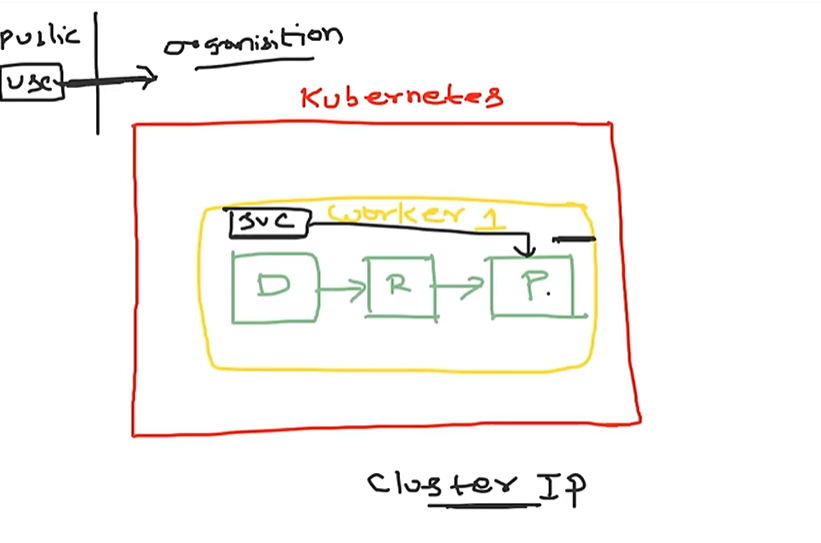

Deployment will do---->it will create Replicaset--->Replicaset will create pods

containers are ephmeral same like pods also ephmeral.Once it is die ,they don't come up.

service discovery mechnaim:The service instead of ipadress it will lookup for the labels.labels and selectors.

Deployment
   |
   |
   |----->metdata--->label

SErvice can do it expose to external world.

1.Clusterip:  

      This is default behavior.your application can access inside the kubernets cluster.

      

       
Internal Microservices Communication: ClusterIP services are commonly used for communication between different microservices or components within the same Kubernetes cluster.
Database Connections: When applications require access to databases or other internal services running within the cluster, ClusterIP services provide a stable and efficient means of communication.
        

2.NodePort:

     It will your application inside your organization ,with in the network .Anybody with in the organiztion and within your network tehncially they might not have access to the kubenrets clsuter they have access your worker node ipaddresses.

     Development and Testing: NodePort services are often used during development and testing phases when external access is required for debugging or validation purposes. Developers can access applications running in the cluster directly via the nodes' IP addresses and designated NodePort.
Prototyping: NodePort services can be useful for quickly prototyping and demonstrating applications without the need for complex networking configurations.

3.Load balancer:

Exposes a set of pods externally using a cloud provider's load balancer.
Production Deployments Requiring External Access: LoadBalancer services are typically used in production environments when applications need to be accessible from outside the Kubernetes cluster, such as web applications or APIs serving external clients.

     

      

