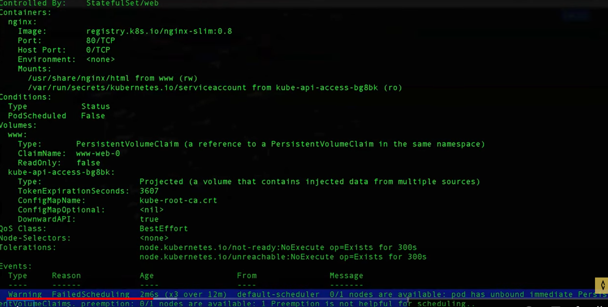
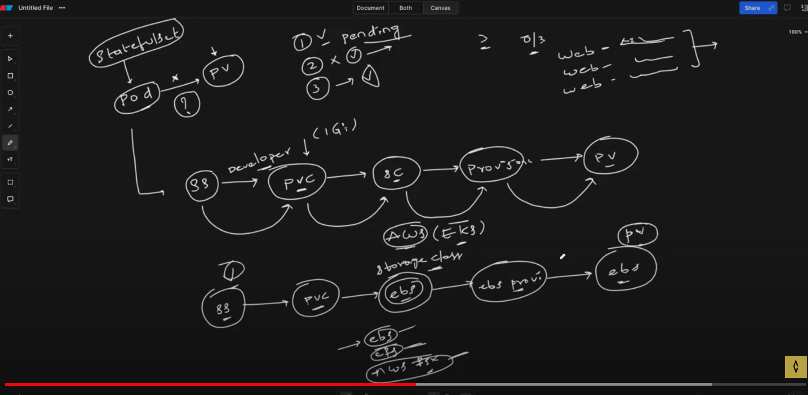

Stateful applications are those that require persistent storage and have unique network identifiers. Examples include databases like MySQL, PostgreSQL, or NoSQL databases like MongoDB.

StatefulSets are useful for applications like databases, where each instance needs its own persistent storage and network identity. By using StatefulSets, you can ensure that your stateful applications are managed effectively in a Kubernetes cluster, with features such as ordered deployment, scaling, and service discovery.

referr:
D:\k8s\Kubernets\statefullset\statefullset.yml

Q)in this 3 replicas i means 3 pods use the same data storage or each pod having different stroges?

  So, in the example StatefulSet with 3 replicas for MySQL, each of the 3 MySQL Pods will have its own dedicated storage volume, providing isolation and independence between instances.

q)if it is different storage any insert or delete opetation on databse, so lets assume  request is going to on one pod and insert was done on the partcular storage .This insertion operation is not avilable on another pod on storage.So next time request takes second pod the may be that insert data will not be avilable right...in this case it is wrong right contains differnet strorages for 3 pods?

     You're correct; in a typical StatefulSet setup for databases like MySQL, having separate storage volumes for each Pod can lead to data inconsistency issues, as you described. If one Pod inserts data into its own storage volume, that data won't be immediately available to other Pods in the StatefulSet

       To address this, StatefulSets in Kubernetes offer a feature called "Headless Service" combined with stable network identifiers. This ensures that each Pod in the StatefulSet has a unique network identity, and applications can discover and communicate with each other reliably.

       In the context of MySQL, you typically configure MySQL to use replication between instances, ensuring that data inserted into one Pod is replicated to other Pods in the cluster. This way, even though each Pod has its own storage volume, they all eventually contain the same data, providing consistency across the StatefulSet.

       Here's a high-level overview of how you might achieve this:

Configure MySQL replication: Set up MySQL replication between the instances running in each Pod. This ensures that changes made to the database in one Pod are replicated to other Pods in the StatefulSet.

Use a Headless Service: Define a Headless Service for your StatefulSet. This allows each Pod to have a stable network identity (DNS name), making it easier for other Pods to discover and communicate with each other.

Handle failover and recovery: Implement mechanisms to handle failover and recovery in case one Pod fails. This could involve automatic promotion of a replica to become the new primary instance, for example.

By combining these approaches, you can ensure that even though each Pod in the StatefulSet has its own storage volume, they all contain consistent data and can operate as part of a single, coherent database cluster.

q)how to configure mysql replication as mentioned in step1
Configuring MySQL replication involves setting up a master-slave relationship between MySQL instances, where changes made to the master are replicated to one or more slave instances. In the context of Kubernetes and StatefulSets, you would typically configure MySQL replication between the instances running in each Pod.

**********************************************************************************************************************

     Abisheik video:

     https://www.youtube.com/watch?v=uBhjymTV0ro

     issue:pods are not getting scheduled.

     describe screenshot below: pod has unbound immediate persistenet voluem claims .preemptions 0/1 nodes  

           
    

    you are deployed a pod through a statefullset ,statefullset---->pod-------------->persistince volume 

    pod is requested for persistance volume but it is not finding the persistance volume.

    so you havbe 3 replicasets ,
    
    deployment:
    you will 0/3 pods will be running.all of them trying to get scehuled.

    statefullset:

    even you have 3 replicases,the second wil be created once the first one success.

    if the first one is pending status,the second one doesn't even get scheduled.

    workflow of statefullset:

      
      statefulset---->pod----->request for pv

