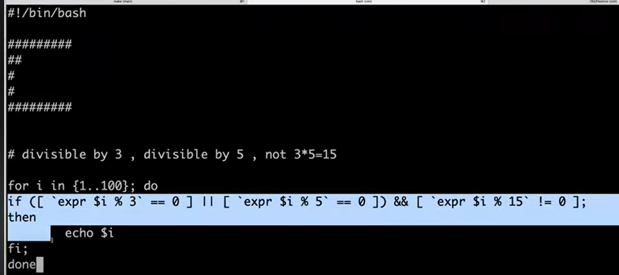
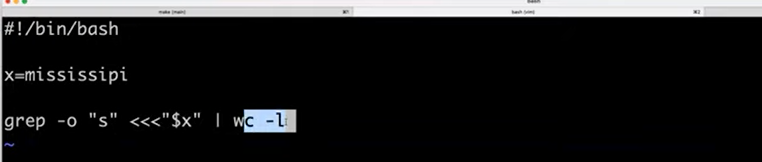
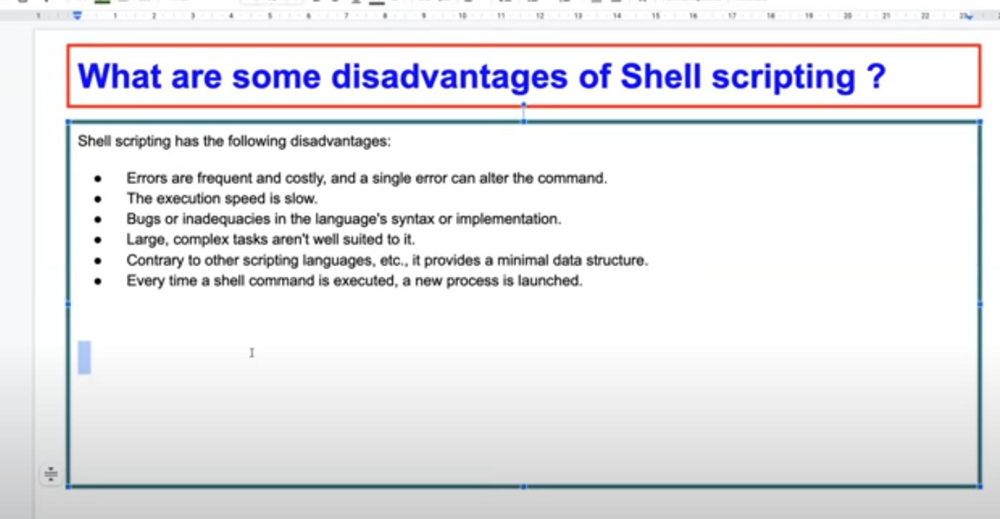

commands:

netcat,route,trace,Top,Sar

2.Write script to list all the process idd?

   ps -ef | awk" ' -F '{print $2}'

3.write script only errors from remote logs

  curl copyremotelogfilelocation | grep error

4.write shell script to print numbers divided by 3&5 and not 15

   print even numbers
   print odd numbers
   print numbers dibisible by 3
   print prime numbers

   

5.write script number of "s" in mississippe

6.how will you debugh the shell script

  set -x   it will run in debug mode.

7.what is cronntab in linux ?can you provide an exaple of usage.

  crontab-->linuxadmin

  every day 6 am morning you have to send report -->node health

  cronntab its like an alaram.

8.how to open a file in read-only file

vim -r test.txt

8.what is the differnce between soft and hard link

   creat file and save file.

   this get save in a memory or in disk.

   if you wan to reuse and multiple times,take the copy of file aand modifed insuch cases hardlink.

   for exaples you have secreat files ,even it is deleted original file still copy should be avilable if your hardlink.

9.break and continue statement.

10.what are the disadvatnage of shell scripting?

11.what are the differnect types of loops and when to use?

12.is bash dynamic or statically types and why?

13.explain about network troubleshooting utility?

  traceroute
  tracepath

14.how will you sort list of names in afile?

sort commanad

15.how will you manage logs of a system that generates huge log files everyday?

Logrotate---->how many days you want ,zip this logs ,after 30 days you can delete

