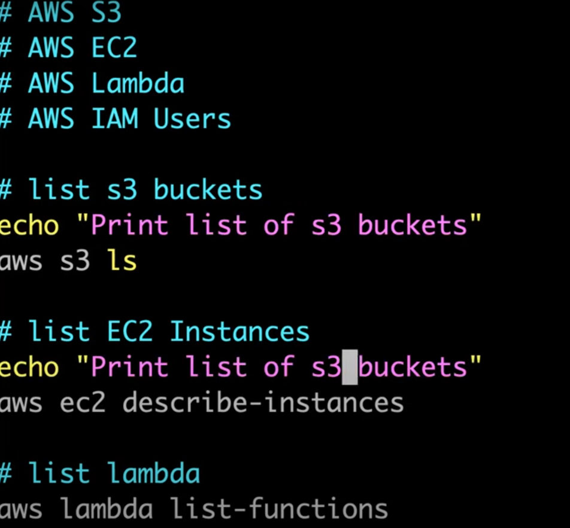

write a script to report the usage of AWS in your project?

https://docs.aws.amazon.com/cli/latest/reference/s3/

to beautify the json format: use jq  

jq is json parser

yq is yaml parser

aws ec2 describe-instnace | jq '.Reservations[].instances[].instanceid' 

