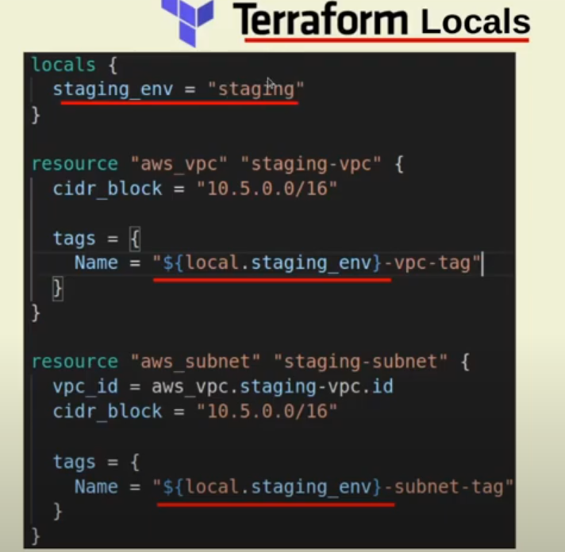
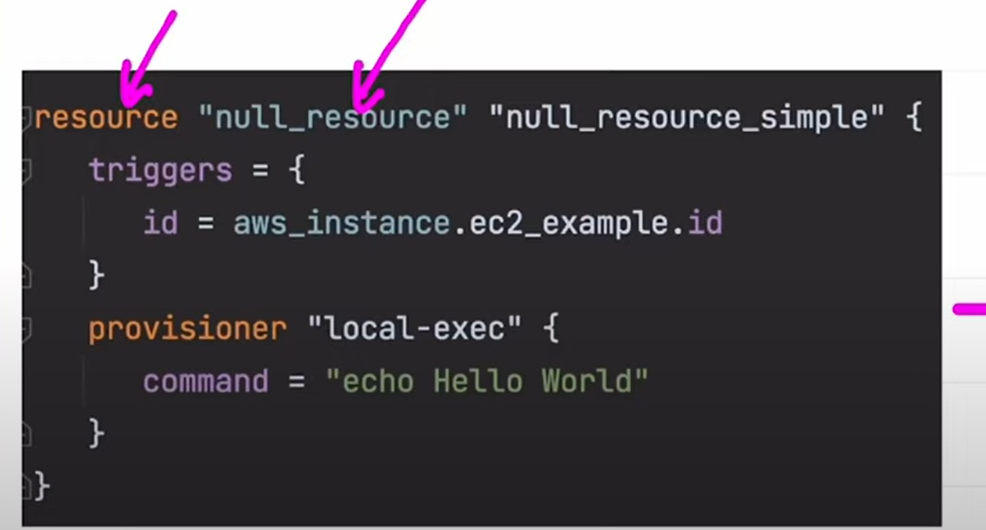
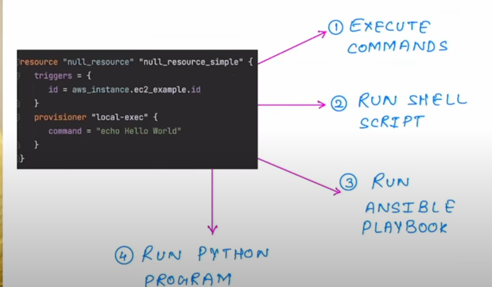

locals:

if we want to apply same file in prod and staging better to define in the locals

here the below is the snippet code.

***************************************************************************************************************
                               null_resource
code snippet for  null_resource

use cases of null_resource:

 execute the shell command

 run shell scripts

 run ansible playbooks

 run python program

 in case trigger  not enabled:

 null_resource first terraform apply it will execute

 but second terraform apply it will not execute 

if you put the trigger ,if it find any changes then only it will trigger and excute 

if the value has changed in the triger then only it will exeucte 